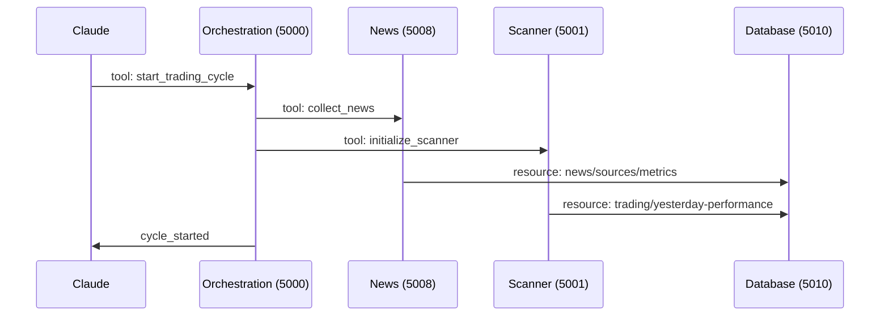
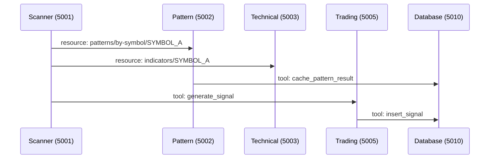
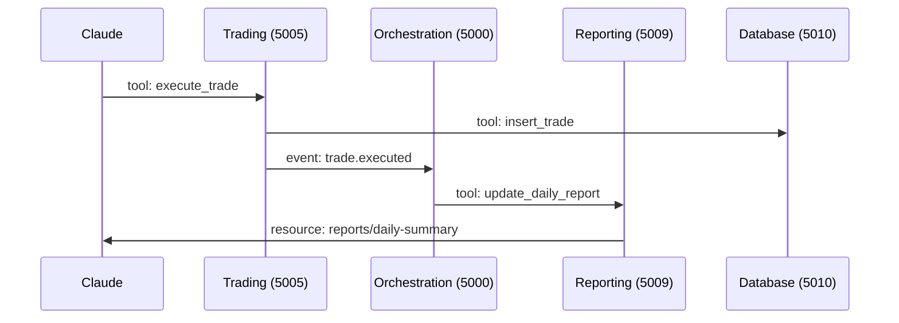

# Catalyst Trading System - MCP Data Flow & Service Interaction Map v3.1.0

**Version**: 3.1.0  
**Last Updated**: 2025-08-23  
**Purpose**: Complete map of data flow through MCP resources and tools

## Revision History

### v3.1.0 (August 23, 2025)
- **Port Alignment**: Updated to match corrected architecture v3.1.0
- **Orchestration Service**: Correctly referenced at port 5000
- **Service Names**: Aligned with actual implementation
- **Flow Corrections**: Updated data flow to reflect actual service interactions

### v3.0.0 (December 30, 2024)
- Initial MCP data flow documentation

## Overview

This document traces how data flows through the MCP-based Catalyst Trading System, showing resource access patterns, tool invocations, and event streams that replace traditional REST APIs and direct database access.

## MCP Data Flow Architecture

### Key Concepts

1. **Resources**: Read-only data access points (replacing GET endpoints)
2. **Tools**: Action invocations that modify state (replacing POST/PUT/DELETE)
3. **Events**: Real-time data streams via MCP subscriptions
4. **Sessions**: Stateful contexts for multi-step workflows

## Data Flow Stages with MCP

### Stage 1: News Collection & Intelligence

#### News Intelligence MCP Server (Port 5008)

**Resource Access Patterns:**
```yaml
# Read news data
resource: news/raw
params:
  since: <timestamp>
  limit: 100
  filters:
    market_state: pre-market
    source_tier: [1,2]
returns:
  type: news_collection
  data: [NewsArticle]
  metadata: {count, last_updated}

# Get symbol-specific news
resource: news/by-symbol/{symbol}
params:
  timeframe: 24h
  include_sentiment: true
returns:
  type: symbol_news
  data: [NewsWithSentiment]
```

**Tool Invocations:**
```yaml
# Trigger news collection
tool: collect_news
params:
  sources: [newsapi, alphavantage, finnhub]
  mode: aggressive
returns:
  collected: 145
  new: 89
  duplicates: 56
  duration: 4.2s

# Analyze sentiment
tool: analyze_sentiment
params:
  symbol: SYMBOL_A
  include_related: true
returns:
  sentiment: bullish
  confidence: 0.85
  key_themes: [earnings_beat, sector_growth]
```

**Event Streams:**
```python
# Subscribe to real-time news
subscription: news.realtime
filter:
  symbols: [SYMBOL_A, SYMBOL_B, SYMBOL_C]
  min_tier: 3
events:
  - type: news.article
    data: {symbol, headline, sentiment, catalyst_score}
  - type: news.alert
    data: {symbol, alert_type, urgency}
```

### Stage 2: Security Scanning & Selection

#### Scanner MCP Server (Port 5001)

**Resource Access:**
```yaml
# Get current candidates
resource: candidates/active
returns:
  type: trading_candidates
  data:
    - symbol: SYMBOL_A
      catalyst_score: 8.5
      volume_ratio: 4.2
      news_count: 7
    - symbol: SYMBOL_B
      catalyst_score: 7.8
      volume_ratio: 3.1
      news_count: 4

# Get scanning metrics
resource: scanner/metrics
returns:
  type: scanner_metrics
  data:
    scanned_today: 2847
    candidates_found: 89
    signals_generated: 23
    success_rate: 0.67
```

**Tool Invocations:**
```yaml
# Create trading candidate
tool: create_candidate
params:
  symbol: SYMBOL_A
  catalyst:
    type: earnings_surprise
    magnitude: significant
    source_quality: high
  technical_setup:
    pattern: bull_flag
    resistance: 45.20
    support: 43.80
returns:
  candidate_id: cand_20241230_001
  priority: high
  estimated_probability: 0.72

# Run market scan
tool: run_market_scan
params:
  focus: pre_market_movers
  min_volume: 1000000
  news_required: true
returns:
  candidates_found: 12
  processing_time: 8.3s
```

### Stage 3: Pattern Recognition & Analysis

#### Pattern Recognition MCP Server (Port 5002)

**Resource Access:**
```yaml
# Get pattern analysis
resource: patterns/by-symbol/{symbol}
params:
  timeframe: [5m, 15m, 1h]
  pattern_types: [breakout, flag, wedge]
returns:
  type: pattern_analysis
  data:
    patterns_found:
      - type: bull_flag
        timeframe: 15m
        confidence: 0.85
        entry: 44.50
        target: 46.20
        stop: 43.90

# Get pattern statistics
resource: patterns/statistics
params:
  lookback_days: 30
returns:
  type: pattern_stats
  data:
    by_pattern:
      bull_flag: {success_rate: 0.68, avg_gain: 0.023}
      cup_handle: {success_rate: 0.71, avg_gain: 0.031}
```

### Stage 4: Technical Analysis

#### Technical Analysis MCP Server (Port 5003)

**Resource Access:**
```yaml
# Get technical indicators
resource: indicators/{symbol}
params:
  indicators: [rsi, macd, vwap, ma_20, ma_50]
  timeframe: 5m
returns:
  type: technical_indicators
  data:
    rsi: {value: 68.5, signal: neutral}
    macd: {histogram: 0.12, signal: bullish}
    vwap: {value: 44.85, position: above}
    ma_20: {value: 44.20, trend: rising}
    ma_50: {value: 43.50, trend: rising}

# Get market structure
resource: market-structure/{symbol}
returns:
  type: market_structure
  data:
    trend: uptrend
    key_levels:
      resistance: [45.20, 46.00, 47.50]
      support: [44.00, 43.50, 42.80]
    volume_profile:
      point_of_control: 44.50
      value_area_high: 45.00
      value_area_low: 44.00
```

### Stage 5: Trading Execution

#### Trading Execution MCP Server (Port 5005)

**Tool Invocations:**
```yaml
# Execute trade
tool: execute_trade
params:
  signal_id: sig_20241230_001
  symbol: SYMBOL_A
  side: buy
  quantity: 1000
  order_type: limit
  limit_price: 44.55
  stop_loss: 43.90
  take_profit: 46.20
returns:
  trade_id: trd_20241230_001
  status: filled
  fill_price: 44.54
  commission: 1.00

# Update position
tool: update_position
params:
  trade_id: trd_20241230_001
  action: adjust_stop
  new_stop: 44.20
returns:
  updated: true
  new_risk: 340.00
```

### Stage 6: Orchestration & Coordination

#### Orchestration MCP Server (Port 5000) [CORRECTED]

**Resource Access:**
```yaml
# Get system status
resource: system/status
returns:
  type: system_status
  data:
    services:
      news_intelligence: {status: healthy, port: 5008}
      scanner: {status: healthy, port: 5001}
      pattern_recognition: {status: healthy, port: 5002}
      technical_analysis: {status: healthy, port: 5003}
      trading_execution: {status: healthy, port: 5005}
      reporting: {status: healthy, port: 5009}
    trading_state:
      mode: live
      positions_open: 3
      daily_pnl: 1247.50

# Get workflow status
resource: workflow/current
returns:
  type: workflow_status
  data:
    stage: monitoring
    next_scan: 2024-12-30T14:30:00Z
    active_candidates: 5
    pending_signals: 2
```

**Tool Invocations:**
```yaml
# Start trading cycle
tool: start_trading_cycle
params:
  mode: paper
  focus: tech_momentum
  risk_per_trade: 1000
returns:
  cycle_id: cycle_20241230
  status: started
  services_activated: 6

# Emergency stop
tool: emergency_stop
params:
  reason: market_volatility
  close_positions: true
returns:
  positions_closed: 3
  services_stopped: 6
  total_pnl: -234.50
```

## Data Flow Sequences

### 1. Morning Startup Sequence



### 2. Signal Generation Flow



### 3. Trade Execution Flow



## Event Stream Patterns

### Real-Time Event Subscriptions

```yaml
Market Events:
  subscription: market.events
  events:
    - market.open
    - market.close
    - market.halt
    - market.volatility_spike

News Events:
  subscription: news.events
  events:
    - news.breaking
    - news.sentiment_shift
    - news.volume_spike

Trading Events:
  subscription: trading.events
  events:
    - signal.generated
    - trade.executed
    - position.closed
    - stop.triggered

System Events:
  subscription: system.events
  events:
    - service.unhealthy
    - resource.exhausted
    - error.critical
```

## Performance Optimization

### Resource Caching Strategy

```yaml
High-Frequency Cache (5s TTL):
  - market prices
  - order book depth
  - current positions

Medium-Frequency Cache (1m TTL):
  - technical indicators
  - pattern analysis
  - news sentiment

Low-Frequency Cache (5m TTL):
  - source metrics
  - historical patterns
  - system configuration
```

### Batch Processing Windows

```yaml
Pre-Market (4:00 AM - 9:30 AM):
  - Aggressive news collection
  - Full market scanning
  - Pattern pre-computation

Market Hours (9:30 AM - 4:00 PM):
  - Real-time processing only
  - Incremental updates
  - Event-driven actions

After-Hours (4:00 PM - 8:00 PM):
  - Performance analysis
  - Report generation
  - Model updates
```

## Error Handling & Recovery

### Circuit Breaker Patterns

```yaml
Service Circuit Breakers:
  threshold: 5 failures in 1 minute
  timeout: 30 seconds
  half-open_test: 1 request

Resource Circuit Breakers:
  threshold: 10 failures in 1 minute
  timeout: 60 seconds
  fallback: cached_data
```

### Retry Strategies

```yaml
Critical Operations (trades):
  max_retries: 3
  backoff: exponential
  base_delay: 100ms

Non-Critical Operations (analysis):
  max_retries: 1
  backoff: none
  fallback: skip
```

## Summary

The MCP Data Flow Architecture v3.1.0 provides:

1. **Clear Separation**: Resources for reads, tools for writes
2. **Event-Driven**: Real-time subscriptions for responsive trading
3. **Cached Efficiency**: Strategic caching for performance
4. **Error Resilience**: Circuit breakers and retry logic
5. **Port Clarity**: Orchestration correctly on port 5000

This corrected data flow ensures smooth operation of the Catalyst Trading System with proper service coordination.