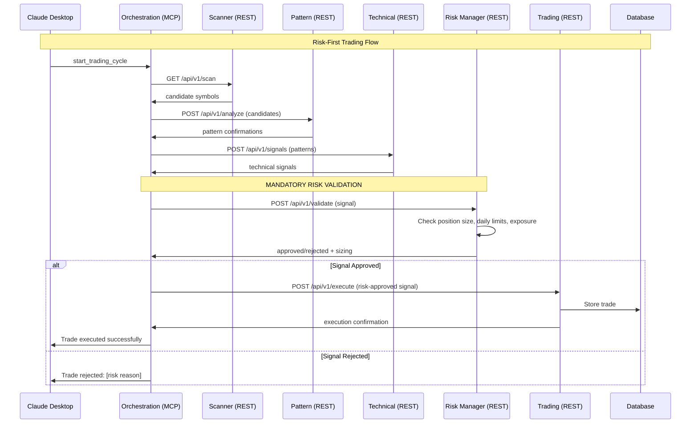

# Catalyst Trading System - MCP Architecture v4.2

**Name of Application**: Catalyst Trading System  
**Name of file**: architecture-mcp-v42.md  
**Version**: 4.2.0  
**Last Updated**: 2025-09-20  
**Purpose**: Updated MCP architecture with integrated risk management

**REVISION HISTORY**:

- v4.2.0 (2025-09-20) - Added Risk Management Service
  - Integrated risk-manager service (port 5004)
  - Updated service matrix to 8 services
  - Added risk management data flows
  - Enhanced trading safety protocols
  - Updated resource hierarchies

**Description**: 
Production-ready architecture implementing Anthropic's Model Context Protocol with comprehensive risk management, hierarchical URIs, error handling, and safety protocols.

---

## Executive Summary

The Catalyst Trading System v4.2 implements an enhanced MCP architecture with:

1. **Risk-First Design**: Mandatory risk validation for all trades
2. **8-Service Architecture**: Added dedicated risk management service
3. **Hierarchical URI Structure**: Organized resource paths for scalability
4. **FastMCP Best Practices**: Context parameters and initialization hooks
5. **Safety Protocols**: Multi-layer risk controls and monitoring

---

## Enhanced Service Matrix

### Service Architecture (8 Services)

| Service          | Protocol | Port     | Responsibilities                                      |
| ---------------- | -------- | -------- | ----------------------------------------------------- |
| Orchestration    | MCP      | 5000     | Claude interface, workflow coordination               |
| Scanner          | REST     | 5001     | Market scanning (200 securities → 5 final)            |
| Pattern          | REST     | 5002     | Pattern detection on candidates                       |
| Technical        | REST     | 5003     | Technical indicators and signals                      |
| **Risk Manager** | **REST** | **5004** | **Position sizing, risk validation, safety controls** |
| Trading          | REST     | 5005     | Order execution (risk-approved trades only)           |
| News             | REST     | 5008     | Catalyst detection and sentiment                      |
| Reporting        | REST     | 5009     | Performance analytics with risk metrics               |

### Enhanced System Architecture

```
┌─────────────────────────────────────────────────────────────────┐
│                        Claude Desktop                           │
│                    (MCP Client via stdio)                       │
└──────────────────────────┬──────────────────────────────────────┘
                          │
                          │ MCP Protocol (stdio/websocket)
                          ↓
┌─────────────────────────────────────────────────────────────────┐
│           Orchestration Service (Port 5000)                     │
│                    FastMCP Server                               │
│                                                                 │
│  Resources (Hierarchical):      Tools (Actions):               │
│  ├── trading-cycle/             • start_trading_cycle          │
│  │   ├── current                • stop_trading                 │
│  │   └── status                 • execute_trade                │
│  ├── market-scan/               • update_risk_parameters       │
│  │   └── candidates/            • close_all_positions          │
│  │       ├── active             • trigger_market_scan          │
│  │       └── rejected           • emergency_stop               │
│  ├── risk-management/           • validate_position_size       │
│  │   ├── parameters             • check_daily_limits           │
│  │   ├── metrics                                              │
│  │   └── exposure                                             │
│  └── analytics/                                               │
│      ├── daily-summary                                        │
│      └── performance                                          │
└─────────────────────────────────────────────────────────────────┘
                          │
                          │ REST API calls to internal services
                          ↓
┌─────────────────────────────────────────────────────────────────┐
│                    Internal REST Services                       │
│                                                                 │
│  ┌─────────────┐  ┌─────────────┐  ┌─────────────┐             │
│  │   Scanner   │  │   Pattern   │  │ Technical   │             │
│  │ Port 5001   │  │ Port 5002   │  │ Port 5003   │             │
│  └─────────────┘  └─────────────┘  └─────────────┘             │
│                                                                 │
│  ┌─────────────┐  ┌─────────────┐  ┌─────────────┐             │
│  │Risk Manager │  │   Trading   │  │    News     │             │
│  │ Port 5004   │  │ Port 5005   │  │ Port 5008   │             │
│  └─────────────┘  └─────────────┘  └─────────────┘             │
│                                                                 │
│  ┌─────────────┐                                               │
│  │ Reporting   │                                               │
│  │ Port 5009   │                                               │
│  └─────────────┘                                               │
└─────────────────────────────────────────────────────────────────┘
                          │
                          │ Direct connections
                          ↓
┌─────────────────────────────────────────────────────────────────┐
│                   DigitalOcean Infrastructure                   │
│                                                                 │
│  ┌─────────────────────┐    ┌─────────────────────┐            │
│  │  Managed PostgreSQL │    │    Redis Cache      │            │
│  │     (Port 25060)    │    │    (Port 6379)      │            │
│  │  - Trading data     │    │  - Session cache    │            │
│  │  - Risk metrics     │    │  - Market data      │            │
│  │  - Position history │    │  - Pattern cache    │            │
│  └─────────────────────┘    └─────────────────────┘            │
└─────────────────────────────────────────────────────────────────┘
```

---

## Risk-Integrated Data Flow

### Enhanced Trading Flow with Risk Management



### Risk Monitoring Flow

```mermaid
sequenceDiagram
    participant R as Risk Manager
    participant TR as Trading
    participant O as Orchestration
    participant C as Claude Desktop

    Note over R,C: Continuous Risk Monitoring

    loop Every 30 seconds
        R->>TR: GET /api/v1/positions
        TR->>R: current positions + P&L
        R->>R: Calculate exposure, daily loss

        alt Risk Threshold Exceeded
            R->>O: POST /api/v1/alert (risk breach)
            O->>C: 🚨 Risk Alert: Daily loss limit approaching
        end

        alt Emergency Stop Required
            R->>TR: POST /api/v1/emergency-stop
            R->>O: POST /api/v1/emergency-stop
            O->>C: 🛑 Emergency stop triggered
        end
    end
```



---

## Enhanced MCP Resources

### Risk Management Resources

```python
# Orchestration Service MCP Resources

@mcp.resource("risk-management/parameters")
async def get_risk_parameters(ctx: Context) -> Dict:
    """Get current risk management parameters"""
    async with state.http_session.get(f"{RISK_MANAGER_URL}/api/v1/parameters") as resp:
        return await resp.json()

@mcp.resource("risk-management/metrics")
async def get_risk_metrics(ctx: Context) -> Dict:
    """Get real-time risk metrics"""
    async with state.http_session.get(f"{RISK_MANAGER_URL}/api/v1/metrics") as resp:
        metrics = await resp.json()
        return {
            "daily_pnl": metrics.get("daily_pnl", 0),
            "daily_loss_limit": metrics.get("daily_loss_limit", 2000),
            "remaining_risk_budget": metrics.get("remaining_risk_budget", 0),
            "open_exposure": metrics.get("open_exposure", 0),
            "max_exposure_limit": metrics.get("max_exposure_limit", 10000),
            "position_count": metrics.get("position_count", 0),
            "risk_score": metrics.get("risk_score", 0),  # 0-100
            "timestamp": datetime.now().isoformat()
        }

@mcp.resource("risk-management/exposure")
async def get_exposure_breakdown(ctx: Context) -> Dict:
    """Get detailed exposure breakdown"""
    async with state.http_session.get(f"{RISK_MANAGER_URL}/api/v1/exposure") as resp:
        return await resp.json()
```

### Enhanced Trading Tools

```python
@mcp.tool()
async def execute_trade_with_risk_check(
    ctx: Context,
    symbol: str,
    side: str,
    confidence: float,
    signal_data: Dict
) -> Dict:
    """Execute trade with mandatory risk validation"""

    # Step 1: Risk validation
    risk_request = {
        "symbol": symbol,
        "side": side,
        "confidence": confidence,
        "signal_data": signal_data
    }

    async with state.http_session.post(
        f"{RISK_MANAGER_URL}/api/v1/validate-trade",
        json=risk_request
    ) as resp:
        risk_result = await resp.json()

    if not risk_result.get("approved", False):
        return {
            "success": False,
            "rejected_by_risk_manager": True,
            "reason": risk_result.get("reason", "Risk validation failed"),
            "risk_details": risk_result
        }

    # Step 2: Execute with risk-approved parameters
    trade_request = {
        **signal_data,
        "position_size": risk_result["approved_position_size"],
        "stop_loss": risk_result["stop_loss"],
        "take_profit": risk_result.get("take_profit")
    }

    async with state.http_session.post(
        f"{TRADING_URL}/api/v1/execute",
        json=trade_request
    ) as resp:
        trade_result = await resp.json()

    return {
        "success": True,
        "trade_result": trade_result,
        "risk_validation": risk_result
    }

@mcp.tool()
async def update_risk_parameters(
    ctx: Context,
    max_daily_loss: Optional[float] = None,
    max_position_size: Optional[float] = None,
    max_portfolio_risk: Optional[float] = None
) -> Dict:
    """Update risk management parameters"""

    updates = {}
    if max_daily_loss is not None:
        updates["max_daily_loss"] = max_daily_loss
    if max_position_size is not None:
        updates["max_position_size"] = max_position_size
    if max_portfolio_risk is not None:
        updates["max_portfolio_risk"] = max_portfolio_risk

    async with state.http_session.post(
        f"{RISK_MANAGER_URL}/api/v1/update-parameters",
        json=updates
    ) as resp:
        result = await resp.json()

    return {
        "success": True,
        "updated_parameters": result,
        "message": "Risk parameters updated successfully"
    }

@mcp.tool()
async def emergency_stop_trading(ctx: Context, reason: str) -> Dict:
    """Emergency stop all trading activities"""

    # Stop trading service
    async with state.http_session.post(
        f"{TRADING_URL}/api/v1/emergency-stop",
        json={"reason": reason}
    ) as resp:
        trading_result = await resp.json()

    # Notify risk manager
    async with state.http_session.post(
        f"{RISK_MANAGER_URL}/api/v1/emergency-stop",
        json={"reason": reason}
    ) as resp:
        risk_result = await resp.json()

    # Update system state
    state.workflow_state = WorkflowState.EMERGENCY_STOP

    return {
        "success": True,
        "reason": reason,
        "timestamp": datetime.now().isoformat(),
        "trading_stopped": trading_result.get("success", False),
        "risk_manager_notified": risk_result.get("success", False)
    }
```

---

## Risk Management Service Specification

### REST API Endpoints

```python
# Risk Manager Service (Port 5004)

# GET /api/v1/parameters
# Returns current risk parameters

# GET /api/v1/metrics  
# Returns real-time risk metrics

# GET /api/v1/exposure
# Returns exposure breakdown by symbol/sector

# POST /api/v1/validate-trade
# Validates proposed trade against risk limits

# POST /api/v1/calculate-position-size
# Calculates optimal position size for symbol

# POST /api/v1/update-parameters
# Updates risk management parameters

# POST /api/v1/emergency-stop
# Triggers emergency stop procedures
```

### Risk Parameters

```python
DEFAULT_RISK_PARAMETERS = {
    "max_daily_loss": 2000,          # Maximum daily loss ($)
    "max_position_size": 0.1,        # 10% of portfolio per position
    "max_portfolio_risk": 0.05,      # 5% total portfolio risk
    "position_size_multiplier": 1.0, # Position sizing adjustment
    "stop_loss_atr_multiple": 2.0,   # Stop loss distance
    "take_profit_atr_multiple": 3.0, # Take profit distance
    "max_positions": 5,              # Maximum concurrent positions
    "risk_free_rate": 0.05,         # For Sharpe ratio calculations
    "correlation_limit": 0.7,        # Max correlation between positions
    "sector_concentration_limit": 0.4 # Max 40% in one sector
}
```

---

## Enhanced Database Schema

### Risk Management Tables

```sql
-- Risk parameters history
CREATE TABLE risk_parameters (
    parameter_id SERIAL PRIMARY KEY,
    parameter_name VARCHAR(50) NOT NULL,
    parameter_value DECIMAL(12,4) NOT NULL,
    set_by VARCHAR(50),
    effective_from TIMESTAMPTZ NOT NULL DEFAULT NOW(),
    effective_to TIMESTAMPTZ,
    created_at TIMESTAMPTZ NOT NULL DEFAULT NOW()
);

-- Daily risk metrics
CREATE TABLE daily_risk_metrics (
    date DATE PRIMARY KEY,
    daily_pnl DECIMAL(12,2) NOT NULL DEFAULT 0,
    max_daily_loss DECIMAL(12,2) NOT NULL,
    position_count INTEGER NOT NULL DEFAULT 0,
    total_exposure DECIMAL(12,2) NOT NULL DEFAULT 0,
    risk_score DECIMAL(5,2) NOT NULL DEFAULT 0,
    var_95 DECIMAL(12,2),
    max_drawdown DECIMAL(12,2),
    sharpe_ratio DECIMAL(6,3),
    created_at TIMESTAMPTZ NOT NULL DEFAULT NOW(),
    updated_at TIMESTAMPTZ NOT NULL DEFAULT NOW()
);

-- Risk events (violations, warnings, stops)
CREATE TABLE risk_events (
    event_id SERIAL PRIMARY KEY,
    event_type VARCHAR(20) NOT NULL CHECK (event_type IN ('warning', 'violation', 'emergency_stop')),
    severity VARCHAR(10) NOT NULL CHECK (severity IN ('low', 'medium', 'high', 'critical')),
    description TEXT NOT NULL,
    triggered_by VARCHAR(50),
    metrics_snapshot JSONB,
    resolved_at TIMESTAMPTZ,
    created_at TIMESTAMPTZ NOT NULL DEFAULT NOW()
);
```

---

## Success Metrics

| Metric                   | Target      | Measurement                   |
| ------------------------ | ----------- | ----------------------------- |
| Risk System Uptime       | 99.9%       | Health check monitoring       |
| Trade Rejection Rate     | 5-15%       | Risk validation effectiveness |
| Daily Loss Limit Breach  | 0%          | Risk control success          |
| Position Sizing Accuracy | >95%        | Risk calculation precision    |
| Emergency Stop Response  | <5 seconds  | Safety system speed           |
| Risk Alert Response      | <30 seconds | Monitoring effectiveness      |

---

## Conclusion

The enhanced Catalyst Trading System v4.2 provides:

- ✅ **8-Service Architecture** with dedicated risk management
- ✅ **Risk-First Trading** with mandatory validation
- ✅ **Multi-Layer Safety** controls and monitoring  
- ✅ **Real-Time Risk Metrics** and exposure tracking
- ✅ **Emergency Protocols** for system protection
- ✅ **Comprehensive Risk Resources** via MCP

The system prioritizes capital preservation while maintaining trading effectiveness through intelligent risk management.

---

*DevGenius Hat Status: Risk-managed architecture perfected* 🎩🛡️
