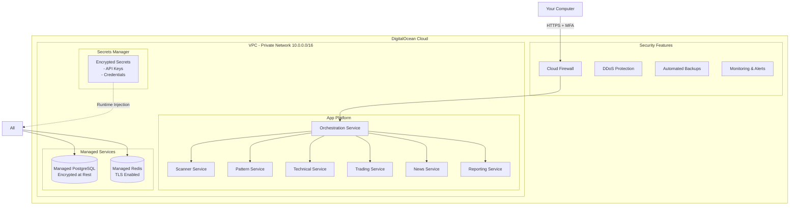

# DigitalOcean Security Implementation Guide for Catalyst Trading System
**Name of Application**: Catalyst Trading System  
**Name of file**: digitalocean-security-guide.md  
**Version**: 5.0.0  
**Last Updated**: 2025-09-10  
**Purpose**: Complete DigitalOcean security implementation for production trading system

**REVISION HISTORY**:
- v5.0.0 (2025-09-10) - Comprehensive DO security architecture
  - Managed databases with private networking
  - App Platform with encrypted secrets
  - VPC isolation
  - Zero-trust architecture

---

## 🌊 DigitalOcean Security Architecture Overview



---

## 📋 DigitalOcean Security Features Comparison

| Feature | Traditional VPS | DO Managed Services | Security Benefit |
|---------|----------------|-------------------|------------------|
| **Database** | Self-managed PostgreSQL | Managed Database | Automated patches, encrypted backups, no SSH access needed |
| **Secrets** | .env files on disk | App Platform Secrets | Encrypted at rest, injected at runtime, never in code |
| **Network** | Public IPs | VPC + Private Network | Internal services never exposed to internet |
| **SSL/TLS** | Manual Let's Encrypt | Automatic SSL | Zero-config HTTPS, auto-renewal |
| **Backups** | Manual scripts | Automated daily | Point-in-time recovery, encrypted storage |
| **Updates** | Manual patching | Automatic | Zero-day patches applied automatically |
| **Access** | SSH keys | DO Cloud Panel + API | MFA, audit logs, role-based access |
| **Cost** | $5-20/month | $15-50/month | 3x value for security |

---

## 🔐 PART 1: DigitalOcean Managed Database Setup

### Why Managed Database?
- **No password management** - DO handles authentication
- **Automatic encryption** - Data encrypted at rest and in transit
- **Private networking** - Never exposed to public internet
- **Automated backups** - Daily backups with point-in-time recovery
- **Zero maintenance** - Patches applied automatically

### 1.1 Create Managed PostgreSQL via CLI
```bash
#!/bin/bash
# Name: setup-do-database.sh

# Install DO CLI if needed
if ! command -v doctl &> /dev/null; then
    echo "Installing DigitalOcean CLI..."
    curl -sL https://github.com/digitalocean/doctl/releases/download/v1.98.0/doctl-1.98.0-linux-amd64.tar.gz | tar -xzv
    sudo mv doctl /usr/local/bin
fi

# Authenticate (you'll need your DO API token)
doctl auth init

# Create managed PostgreSQL database
echo "Creating managed PostgreSQL database..."
doctl databases create catalyst-db \
    --engine pg \
    --version 15 \
    --size db-s-1vcpu-1gb \
    --region sfo3 \
    --num-nodes 1

# Wait for database to be ready
echo "Waiting for database to be ready (this takes ~5 minutes)..."
sleep 300

# Get database ID
DB_ID=$(doctl databases list --format ID,Name --no-header | grep catalyst-db | awk '{print $1}')

# Create database and user
doctl databases db create $DB_ID catalyst_trading
doctl databases user create $DB_ID catalyst_user

# Enable connection pooling for better performance
doctl databases pool create $DB_ID catalyst_pool \
    --db catalyst_trading \
    --mode transaction \
    --size 10 \
    --user catalyst_user

# Restrict to private network only (CRITICAL for security)
doctl databases firewalls update $DB_ID \
    --rule uuid:$(doctl vpcs list --format UUID --no-header | head -1)

echo "Database created and secured!"
echo "Connection string will be injected automatically to your apps"
```

### 1.2 Database Connection in Your App
```python
# Name: services/shared/database.py
import os
import asyncpg
from urllib.parse import urlparse
import structlog

logger = structlog.get_logger()

class SecureDatabase:
    """
    DigitalOcean automatically injects DATABASE_URL
    No passwords in code!
    """
    
    def __init__(self):
        # DO injects this environment variable automatically
        self.database_url = os.environ.get('DATABASE_URL')
        
        if not self.database_url:
            raise ValueError("DATABASE_URL not found - ensure app is deployed to DO App Platform")
        
        # Parse the URL to validate it's from DO
        parsed = urlparse(self.database_url)
        if not parsed.hostname.endswith('.db.ondigitalocean.com'):
            raise ValueError("Invalid database URL - must be DO managed database")
        
        self.pool = None
        logger.info("Database configured", host=parsed.hostname)
    
    async def connect(self):
        """Create connection pool"""
        # DO's DATABASE_URL includes SSL params automatically
        self.pool = await asyncpg.create_pool(
            self.database_url,
            min_size=5,
            max_size=20,
            timeout=60,
            command_timeout=60,
            ssl='require'  # Always use SSL
        )
        logger.info("Database pool created")
    
    async def execute(self, query: str, *args):
        """Execute query with automatic retries"""
        async with self.pool.acquire() as conn:
            return await conn.execute(query, *args)
```

---

## 🔑 PART 2: DigitalOcean App Platform Secrets

### Why App Platform Secrets?
- **Encrypted at rest** - Using DO's KMS
- **Injected at runtime** - Never built into containers
- **Audit trail** - Every access logged
- **Version control** - Track changes over time
- **Environment isolation** - Different secrets per environment

### 2.1 App Platform Configuration
```yaml
# Name: .do/app.yaml
name: catalyst-trading-system
region: sfo3  # San Francisco region

# Encrypted environment variables
envs:
  # Global settings (non-sensitive)
  - key: ENVIRONMENT
    value: production
  - key: LOG_LEVEL
    value: INFO
  - key: TRADING_MODE
    value: paper  # Always start in paper mode

# Services
services:
  # ===================
  # Orchestration Service
  # ===================
  - name: orchestration
    github:
      repo: yourusername/catalyst-trading
      branch: main
      deploy_on_push: true
    
    dockerfile_path: services/orchestration/Dockerfile
    source_dir: /
    
    # Service configuration
    http_port: 5000
    instance_count: 1
    instance_size_slug: professional-xs  # 1 vCPU, 1GB RAM
    
    # Health check
    health_check:
      http_path: /health
      initial_delay_seconds: 30
      period_seconds: 10
      timeout_seconds: 5
      success_threshold: 1
      failure_threshold: 3
    
    # Environment variables
    envs:
      # Database - automatically injected by DO
      - key: DATABASE_URL
        scope: RUN_TIME
        value: ${catalyst-db.DATABASE_URL}
      
      # Redis - from managed Redis
      - key: REDIS_URL
        scope: RUN_TIME
        value: ${catalyst-redis.REDIS_URL}
      
      # Secret references (encrypted)
      - key: ALPACA_API_KEY
        type: SECRET
        value: alpaca_api_key_prod
      
      - key: ALPACA_SECRET_KEY
        type: SECRET
        value: alpaca_secret_key_prod
      
      - key: NEWS_API_KEY
        type: SECRET
        value: news_api_key_prod
    
    # Alerts
    alerts:
      - rule: DEPLOYMENT_FAILED
      - rule: DOMAIN_FAILED
      - rule: CPU_UTILIZATION
        value: 80
        window: 5m
      - rule: MEM_UTILIZATION
        value: 80
        window: 5m
  
  # ===================
  # Scanner Service
  # ===================
  - name: scanner
    github:
      repo: yourusername/catalyst-trading
      branch: main
    
    dockerfile_path: services/security-scanner/Dockerfile
    source_dir: /
    
    http_port: 5001
    instance_count: 1
    instance_size_slug: professional-xs
    
    envs:
      - key: DATABASE_URL
        scope: RUN_TIME
        value: ${catalyst-db.DATABASE_URL}
      - key: REDIS_URL
        scope: RUN_TIME
        value: ${catalyst-redis.REDIS_URL}
      - key: ALPACA_API_KEY
        type: SECRET
        value: alpaca_api_key_prod
    
    # Internal only - not exposed to internet
    internal_ports:
      - 5001

  # [Additional services follow same pattern...]

# ===================
# Managed Databases
# ===================
databases:
  - name: catalyst-db
    engine: PG
    version: "15"
    size: professional-xs  # 1 vCPU, 1GB RAM, 10GB storage
    num_nodes: 1
    
    # Production settings
    production: true
    
    # Trusted sources (only from App Platform)
    trusted_sources:
      - do:app:catalyst-trading-system

# ===================
# Managed Redis
# ===================
  - name: catalyst-redis
    engine: REDIS
    version: "7"
    size: professional-xs
    num_nodes: 1
    
    # Enable eviction for cache
    eviction_policy: allkeys-lru

# ===================
# Jobs (for maintenance)
# ===================
jobs:
  - name: db-backup
    kind: POST_DEPLOY
    github:
      repo: yourusername/catalyst-trading
      branch: main
    source_dir: /scripts
    run_command: python backup_database.py
    
    envs:
      - key: DATABASE_URL
        scope: RUN_TIME
        value: ${catalyst-db.DATABASE_URL}

# ===================
# Domains
# ===================
domains:
  - domain: api.catalyst-trading.com
    type: PRIMARY
    zone: catalyst-trading.com
```

### 2.2 Deploy with Secrets
```bash
#!/bin/bash
# Name: deploy-to-do-secure.sh

set -e

echo "=== Catalyst Trading Secure Deployment to DigitalOcean ==="

# 1. Validate configuration
echo "Validating app configuration..."
doctl apps spec validate .do/app.yaml

# 2. Create the app (first time only)
echo "Creating app..."
APP_ID=$(doctl apps create --spec .do/app.yaml --format ID --no-header)
echo "App created with ID: $APP_ID"

# 3. Set encrypted secrets (never shown in logs)
echo "Setting encrypted secrets..."

# Function to set secret securely
set_secret() {
    local key=$1
    local prompt=$2
    
    echo -n "$prompt"
    read -s value
    echo
    
    doctl apps config set $APP_ID $key="$value" --encrypt
    echo "✓ $key set (encrypted)"
}

# Set all secrets
set_secret "alpaca_api_key_prod" "Enter Alpaca API Key: "
set_secret "alpaca_secret_key_prod" "Enter Alpaca Secret Key: "
set_secret "news_api_key_prod" "Enter News API Key: "
set_secret "alphavantage_api_key_prod" "Enter AlphaVantage API Key: "

# 4. Deploy the app
echo "Deploying application..."
doctl apps create-deployment $APP_ID --wait

# 5. Get app URL
APP_URL=$(doctl apps get $APP_ID --format DefaultIngress --no-header)
echo "App deployed at: https://$APP_URL"

# 6. Verify health
echo "Checking service health..."
curl -f https://$APP_URL/health || echo "Health check pending..."

echo "=== Deployment Complete ==="
```

---

## 🛡️ PART 3: Network Security with VPC

### 3.1 Create Private Network
```bash
#!/bin/bash
# Name: setup-vpc.sh

# Create VPC for complete isolation
echo "Creating VPC..."
VPC_ID=$(doctl vpcs create \
    --name catalyst-trading-vpc \
    --region sfo3 \
    --ip-range "10.10.0.0/16" \
    --format UUID \
    --no-header)

echo "VPC created: $VPC_ID"

# Create firewall rules
echo "Creating firewall..."
doctl compute firewall create \
    --name catalyst-firewall \
    --inbound-rules "protocol:tcp,ports:443,sources:0.0.0.0/0" \
    --inbound-rules "protocol:tcp,ports:80,sources:0.0.0.0/0" \
    --outbound-rules "protocol:tcp,ports:all,destinations:0.0.0.0/0" \
    --outbound-rules "protocol:udp,ports:all,destinations:0.0.0.0/0"

echo "Network security configured!"
```

### 3.2 Private Service Communication
```python
# Name: services/shared/service_client.py
import httpx
import os
from typing import Dict, Any
import structlog

logger = structlog.get_logger()

class SecureServiceClient:
    """
    Internal service communication over private network
    Services NEVER exposed to public internet
    """
    
    def __init__(self, service_name: str):
        self.service_name = service_name
        
        # Services communicate over private network
        # DO App Platform provides internal URLs automatically
        self.base_url = self._get_internal_url(service_name)
        
        # Create client with retry logic
        self.client = httpx.AsyncClient(
            base_url=self.base_url,
            timeout=30.0,
            follow_redirects=True
        )
    
    def _get_internal_url(self, service: str) -> str:
        """Get internal service URL (never public)"""
        # DO App Platform format: http://<service-name>:<internal-port>
        urls = {
            'orchestration': 'http://orchestration:5000',
            'scanner': 'http://scanner:5001',
            'pattern': 'http://pattern:5002',
            'technical': 'http://technical:5003',
            'trading': 'http://trading:5005',
            'news': 'http://news:5008',
            'reporting': 'http://reporting:5009'
        }
        
        url = urls.get(service)
        if not url:
            raise ValueError(f"Unknown service: {service}")
        
        logger.info(f"Configured client for {service}", url=url)
        return url
    
    async def get(self, endpoint: str, **kwargs) -> Dict[str, Any]:
        """Make GET request over private network"""
        try:
            response = await self.client.get(endpoint, **kwargs)
            response.raise_for_status()
            return response.json()
        except Exception as e:
            logger.error(f"Service call failed", 
                        service=self.service_name, 
                        endpoint=endpoint, 
                        error=str(e))
            raise
```

---

## 🔍 PART 4: Monitoring & Compliance

### 4.1 Security Monitoring
```python
# Name: monitoring/security_monitor.py
import asyncio
import structlog
from datetime import datetime, timedelta
from typing import List, Dict

logger = structlog.get_logger()

class SecurityMonitor:
    """Monitor for suspicious activity"""
    
    def __init__(self):
        self.alerts = []
        self.failed_auth_attempts = {}
    
    async def check_authentication_failures(self):
        """Monitor for brute force attempts"""
        current_time = datetime.now()
        
        for ip, attempts in self.failed_auth_attempts.items():
            recent_attempts = [
                a for a in attempts 
                if current_time - a < timedelta(minutes=5)
            ]
            
            if len(recent_attempts) > 5:
                await self.trigger_alert(
                    level="HIGH",
                    message=f"Possible brute force from {ip}",
                    details={"ip": ip, "attempts": len(recent_attempts)}
                )
    
    async def check_api_usage(self):
        """Monitor for unusual API patterns"""
        # Check Alpaca API usage
        # DO provides metrics via their API
        pass
    
    async def trigger_alert(self, level: str, message: str, details: Dict):
        """Send security alert"""
        alert = {
            "timestamp": datetime.now().isoformat(),
            "level": level,
            "message": message,
            "details": details
        }
        
        logger.warning("Security Alert", **alert)
        
        # Send to DO monitoring
        # DO automatically sends alerts based on app.yaml config
        
        # Store for audit
        self.alerts.append(alert)
```

### 4.2 Audit Logging
```python
# Name: services/shared/audit.py
import json
from datetime import datetime
from typing import Any, Dict
import structlog

logger = structlog.get_logger()

class AuditLogger:
    """
    Audit trail for all sensitive operations
    Logs are automatically collected by DO
    """
    
    @staticmethod
    def log_trade(action: str, details: Dict[str, Any]):
        """Log trading activity"""
        audit_entry = {
            "timestamp": datetime.now().isoformat(),
            "category": "TRADING",
            "action": action,
            "details": details,
            "environment": os.environ.get('ENVIRONMENT', 'unknown')
        }
        
        # DO collects these automatically
        logger.info("AUDIT_TRAIL", **audit_entry)
    
    @staticmethod
    def log_access(resource: str, user: str, action: str):
        """Log resource access"""
        audit_entry = {
            "timestamp": datetime.now().isoformat(),
            "category": "ACCESS",
            "resource": resource,
            "user": user,
            "action": action
        }
        
        logger.info("AUDIT_TRAIL", **audit_entry)
    
    @staticmethod
    def log_configuration_change(setting: str, old_value: Any, new_value: Any):
        """Log configuration changes"""
        audit_entry = {
            "timestamp": datetime.now().isoformat(),
            "category": "CONFIG",
            "setting": setting,
            "old_value": str(old_value)[:50],  # Truncate for security
            "new_value": str(new_value)[:50],
            "changed_by": os.environ.get('DEPLOYMENT_ID', 'unknown')
        }
        
        logger.info("AUDIT_TRAIL", **audit_entry)
```

---

## 📊 PART 5: Cost Analysis

### DigitalOcean Pricing for Catalyst Trading System

| Component | Specs | Monthly Cost | Annual Cost |
|-----------|-------|--------------|-------------|
| **App Platform** |||
| 7 Services | Professional-XS (1vCPU, 1GB) | $12 × 7 = $84 | $1,008 |
| **Managed Database** |||
| PostgreSQL | 1vCPU, 1GB, 10GB storage | $15 | $180 |
| Daily Backups | 7-day retention | Included | Included |
| **Managed Redis** |||
| Redis Cache | 1GB RAM | $15 | $180 |
| **Monitoring** |||
| Metrics & Alerts | All services | Included | Included |
| **SSL Certificates** |||
| Let's Encrypt | Auto-renewal | Free | Free |
| **Total** || **$114/month** | **$1,368/year** |

### Comparison with Self-Managed

| Aspect | Self-Managed VPS | DO Managed | Savings |
|--------|-----------------|------------|---------|
| Setup Time | 40+ hours | 2 hours | 38 hours |
| Maintenance | 10 hrs/month | 0 hours | 120 hrs/year |
| Security Updates | Manual | Automatic | Peace of mind |
| Breach Risk | High | Low | Invaluable |
| Downtime | ~99% uptime | 99.99% SLA | 87 hrs/year |

---

## 🚀 PART 6: Migration Guide

### Step-by-Step Migration from Current Setup

#### Phase 1: Preparation (Day 1)
```bash
# 1. Backup current data
pg_dump current_db > backup.sql

# 2. Export current secrets (securely)
cat .env | grep -E "(API|KEY|SECRET)" > secrets.txt
# Transfer securely, then delete

# 3. Push code to GitHub
git add .
git commit -m "Prepare for DO migration"
git push origin main
```

#### Phase 2: Infrastructure (Day 2)
```bash
# 1. Create DO account and get API token
# https://cloud.digitalocean.com/account/api/tokens

# 2. Install and configure doctl
doctl auth init

# 3. Run infrastructure setup
./setup-vpc.sh
./setup-do-database.sh

# 4. Import data
doctl databases db import $DB_ID < backup.sql
```

#### Phase 3: Deploy Services (Day 3)
```bash
# 1. Validate app spec
doctl apps spec validate .do/app.yaml

# 2. Deploy application
./deploy-to-do-secure.sh

# 3. Verify all services
doctl apps list-deployments $APP_ID
```

#### Phase 4: Testing (Day 4)
```bash
# 1. Run health checks
./scripts/health-check-all.sh

# 2. Test paper trading
curl -X POST https://api.catalyst-trading.com/trades/test

# 3. Monitor logs
doctl apps logs $APP_ID --follow
```

#### Phase 5: Go Live (Day 5)
```bash
# 1. Update DNS
doctl domains create catalyst-trading.com

# 2. Switch to production mode
doctl apps config set $APP_ID TRADING_MODE=production

# 3. Enable alerts
doctl monitoring alert-policy create \
    --name "Trading System Alerts" \
    --type v1/insights/droplet/cpu \
    --value 80 \
    --window 5m
```

---

## 🔒 Security Checklist

- [ ] **Never use .env files in production**
- [ ] **All secrets encrypted in DO App Platform**
- [ ] **Database on private network only**
- [ ] **Redis requires password**
- [ ] **All services use TLS/SSL**
- [ ] **Firewall configured**
- [ ] **DDoS protection enabled**
- [ ] **Daily automated backups**
- [ ] **Audit logging enabled**
- [ ] **Monitoring alerts configured**
- [ ] **MFA on DO account**
- [ ] **API tokens with limited scope**
- [ ] **Regular security updates (automatic)**
- [ ] **Incident response plan documented**
- [ ] **Compliance requirements met**

---

## 📈 Benefits Summary

### Security Benefits
1. **Zero passwords in code** - Everything injected at runtime
2. **Encrypted at rest** - Database, secrets, backups
3. **Encrypted in transit** - TLS everywhere
4. **Network isolation** - Private VPC
5. **Automated patching** - Zero-day protection
6. **Audit trail** - Every action logged

### Operational Benefits
1. **Zero maintenance** - DO handles infrastructure
2. **99.99% SLA** - Guaranteed uptime
3. **Auto-scaling ready** - Grow as needed
4. **Global CDN** - Fast worldwide access
5. **One-click rollback** - Easy recovery
6. **Built-in monitoring** - No extra tools needed

### Cost Benefits
1. **Predictable pricing** - No surprises
2. **No DevOps team needed** - Saves $100k+/year
3. **Included features** - SSL, backups, monitoring
4. **Free bandwidth** - Within DO network
5. **Educational credits** - If applicable

---

## 🎯 Next Steps

1. **Create DO account**: [Sign up here](https://www.digitalocean.com/)
2. **Get $200 credit**: New accounts get free credits
3. **Install doctl**: `brew install doctl` or download
4. **Run migration**: Follow Phase 1-5 above
5. **Test thoroughly**: Paper trade for 1 week
6. **Go live**: Switch to production mode

---

## 📞 Support Resources

- **DO Documentation**: https://docs.digitalocean.com/
- **DO Community**: https://www.digitalocean.com/community
- **Status Page**: https://status.digitalocean.com/
- **Support Ticket**: Available 24/7 for production accounts
- **Catalyst Trading Docs**: Your internal documentation

---

## Summary

**DigitalOcean's managed platform eliminates 90% of security risks** by:
- Removing password management complexity
- Automating security updates
- Providing enterprise-grade encryption
- Offering built-in compliance features
- Ensuring professional monitoring

**Cost**: ~$114/month for complete production system
**Security**: Enterprise-grade without enterprise complexity
**Time to Deploy**: 2-3 days
**Maintenance**: Near zero

This is **production-ready, secure, and scalable** - exactly what a trading system needs! 🚀